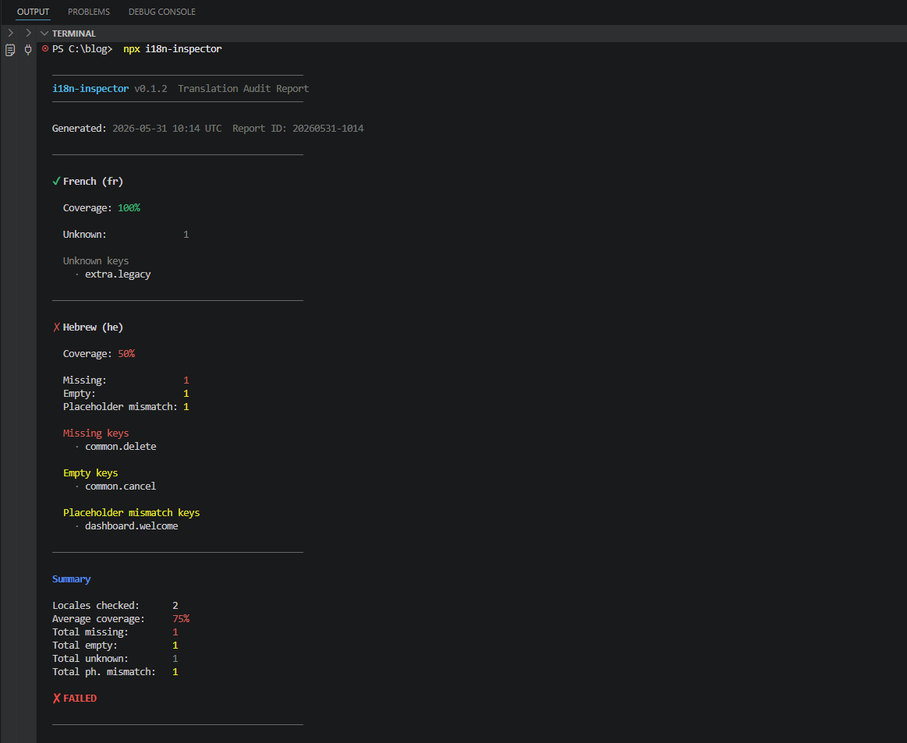
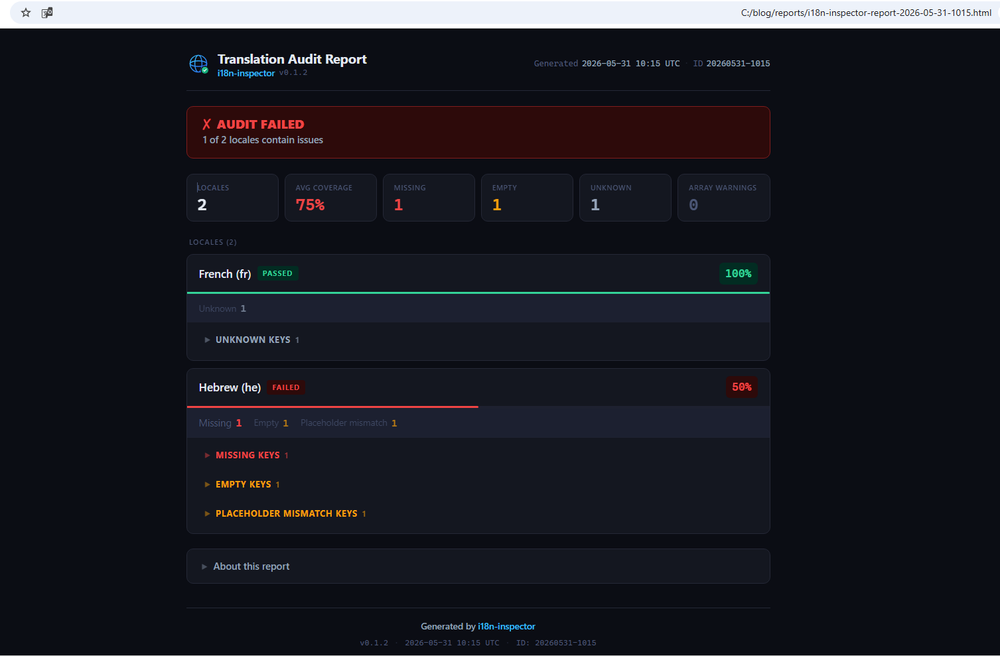

<p align="center">
  
</p>

# i18n-inspector

**Audit your JSON translation files for missing, empty, unknown, and broken keys.**

A CLI tool that compares your source locale against every target locale and tells you exactly what is wrong — key by key. Outputs a colored terminal report and an optional interactive HTML report.

---

## Installation

```bash
npm install -D i18n-inspector
```

```bash
pnpm add -D i18n-inspector
```

```bash
yarn add -D i18n-inspector
```

```bash
bun add -d i18n-inspector
```

---

## Works with

- **[next-intl](https://next-intl-docs.vercel.app/)** — `file-per-locale` and `locale-directories`
- **[react-i18next](https://react.i18next.com/) / [i18next](https://www.i18next.com/)** — `file-per-locale` and `locale-directories`
- Any project that stores translations as **plain JSON files**

> **What this tool is not:**
> `i18n-inspector` is a translation file auditor. It does not scan source code, validate ICU message syntax, detect dead keys, or modify any files. See [Known Limitations](#known-limitations) for the full list.

---

## Quick Start

**1. Detect your locale structure and create a config:**

```bash
npx i18n-inspector init
```

Scans your project, identifies your translation file layout, and writes `i18n-inspector.config.json`.

**2. Run the audit:**

```bash
npx i18n-inspector
```

**3. Generate an HTML report:**

```bash
npx i18n-inspector --html
```

Saves a self-contained HTML file to `./reports/`. Open it in any browser.

<p align="center">
  
</p>

---

## Features

- **Missing key detection** — keys in the source locale that are absent from a target
- **Empty key detection** — keys that exist in the target but have an empty or whitespace-only value (`""`, `"   "`, `"\t"`)
- **Unknown key detection** — keys in a target locale with no corresponding source key
- **Placeholder validation** — detects when `{{ variable }}` placeholders differ between source and target
- **Array warnings** — array-valued keys are detected and reported as warnings instead of being silently skipped
- **Per-locale coverage %** — how much of the source is translated in each target locale
- **HTML reports** — timestamped, self-contained, with search and collapsible key lists
- **CI-friendly exit codes** — `0` clean, `1` issues found, `2` system error
- **Auto-configuration** — `init` writes your config in one command
- **BOM-tolerant** — UTF-8 BOM is stripped automatically before parsing

---

## What It Checks

| Issue | What it means |
|---|---|
| **Missing keys** | Key exists in source, absent in target |
| **Empty keys** | Key exists in target, value is `""` or whitespace-only |
| **Unknown keys** | Key exists in target, absent in source |
| **Placeholder mismatch** | `{{ variable }}` set differs between source and target |

Coverage formula:

```
coverage = (total_source_keys - missing - empty) / total_source_keys × 100
```

Placeholder mismatches and unknown keys **do not lower coverage**.

---

## Validation

Before running any audit, `i18n-inspector` validates the following in order:

1. **Config file exists** — `i18n-inspector.config.json` must be present (or created with `init`)
2. **Config JSON is valid** — the config file must be parseable JSON
3. **Config fields are valid** — required fields (`structure`, `localesPath`, `sourceLocale`, `targetLocales`) must be present and correctly typed
4. **Locale files exist** — every locale in `sourceLocale` and `targetLocales` must have a corresponding file or directory
5. **Locale JSON is valid** — every locale file must be parseable JSON containing a root object

The audit does not start until all five steps pass.

---

## Error Handling

### Config file not found

```
Error: Config file not found.

  Expected: i18n-inspector.config.json

  Next step:

    npx i18n-inspector init

  Or create it manually — see --help for the format.
```

### Invalid JSON in a locale file

```
Error: Invalid JSON syntax in:
./messages/ar.json
Line:   42
Column: 17
Error:  Expected ',' or '}'

Fix the JSON syntax and run again.
```

### No locale structure detected (during init)

```
✗ No locale structure detected.

  Expected one of:

  file-per-locale:
    messages/
      en.json
      he.json

  locale-directories:
    messages/
      en/
        common.json
      he/
        common.json

  At least two locale files or directories are required.
  You can also create i18n-inspector.config.json manually.
```

### Multiple locale roots detected (during init)

```
✗ Multiple locale roots found.

  i18n-inspector found more than one set of translation files:

    ./messages  (file-per-locale)
    ./src/i18n  (locale-directories)

  Create i18n-inspector.config.json manually and set localesPath
  to the directory you want to audit.
```

---

## Support Matrix

### File formats

| Format | Status |
|---|---|
| JSON | Supported |
| JSON5 | Not supported |
| YAML / YML | Not supported |
| TOML, PO, ARB | Not supported |

### Key structures

| Feature | Status | Notes |
|---|---|---|
| Flat JSON | Supported | — |
| Nested JSON | Supported | Flattened to dot-notation (`auth.login.title`) |
| Arrays in JSON | Detected and reported as warnings | Array keys do not affect coverage — see [Known Limitations](#known-limitations) |

### File structures

| Structure | Status |
|---|---|
| `file-per-locale` (one file per language) | Supported |
| `locale-directories` (one folder per language, multiple namespace files) | Supported |

### Locale codes

| Locale code | `init` detection | Runtime (manual config) |
|---|---|---|
| `en`, `he`, `ar`, `fr`, `de` … | Supported | Supported |
| `en-US`, `pt-BR`, `zh-CN`, `zh-TW` … | Supported | Supported |
| `zh-Hans`, `sr-Latn`, `uz-Cyrl` … | **Not detected** | Supported |

`init` uses the pattern `^[a-z]{2}(-[A-Z]{2})?$`. Three-part codes like `zh-Hans` are not auto-detected but work correctly when added to the config manually.

### Placeholder formats

| Format | Status |
|---|---|
| `{{ variable }}` | Supported |
| `{{ user.name }}` (dot-path) | Supported |
| `{variable}` (single braces) | Not supported |
| `:variable` | Not supported |
| `%{variable}` | Not supported |

### Advanced features

| Feature | Status |
|---|---|
| ICU message format (`{count, plural, …}`) | Not supported |
| i18next plural suffixes (`_one`, `_other`, `_few`) | Not supported — see [Known Limitations](#known-limitations) |
| Runtime code scanning (`t("key")`) | Not supported |
| Dead key detection | Not supported |
| Auto-fix / write to translation files | Not supported |

---

## Known Limitations

### 1. Arrays are detected but not compared

JSON arrays are not compared key-by-key. A key whose value is an array will appear as a **Warning** in the report, but it does not affect coverage, missing, or empty counts.

```json
// en.json
{ "steps": ["Create account", "Verify email", "Done"] }

// he.json — steps key is missing
{}
```

Result: `steps` is reported as a **Warning** (array detected and skipped). No missing or coverage impact.

---

### 2. ICU message format is not validated

The placeholder validator only recognizes `{{ variable }}` (double curly braces). ICU syntax — such as `{count, plural, one {item} other {items}}` — uses single braces and is not matched. ICU strings are treated as plain text.

If your source uses `{{ name }}` and a translator converts it to `{name}` (single braces), the tool will report a **placeholder mismatch** because the source set is `["name"]` and the target set is `[]`.

---

### 3. i18next plural suffixes produce false reports

If your source and target files use different key structures for plurals, the comparison will report false Missing and Unknown entries.

```json
// en.json (source — single key)
{ "daysAgo": "{{count}} days ago" }

// he.json (target — i18next suffix convention)
{ "daysAgo_one": "לפני יום אחד", "daysAgo_other": "לפני {{count}} ימים" }
```

Result: `daysAgo` → **Missing**. `daysAgo_one`, `daysAgo_other` → **Unknown**.

The workaround is to use identical key structures in both source and target files.

---

### 4. `init` does not detect extended locale codes

`init` recognizes locale codes matching `xx` or `xx-XX` (e.g. `en`, `en-US`). Codes like `zh-Hans`, `sr-Latn`, or `uz-Cyrl` are not auto-detected. Add them to `targetLocales` in the config manually — they work correctly at runtime.

---

## Configuration

`i18n-inspector.config.json` is written by `init`, or create it manually:

```json
{
  "structure": "file-per-locale",
  "localesPath": "./messages",
  "sourceLocale": "en",
  "targetLocales": ["he", "ar", "fr"]
}
```

### Fields

| Field | Type | Required | Description |
|---|---|---|---|
| `structure` | `"file-per-locale"` \| `"locale-directories"` | Yes | File layout |
| `localesPath` | `string` | Yes | Path to the folder containing locale files |
| `sourceLocale` | `string` | Yes | The reference locale all others are checked against |
| `targetLocales` | `string[]` | Yes | Locales to audit |
| `ignore` | `string[]` | No | Directory names to skip during `init` detection |

### `file-per-locale`

One JSON file per language:

```
messages/
  en.json
  he.json
  ar.json
```

### `locale-directories`

One directory per language, one or more namespace files inside:

```
messages/
  en/
    common.json
    auth.json
  he/
    common.json
    auth.json
```

All namespace files for a locale are deep-merged before comparison. Keys are flattened to dot-notation at any depth.

---

## CLI Reference

```
i18n-inspector              Audit all target locales, print report to terminal
i18n-inspector init         Auto-detect locale structure, write i18n-inspector.config.json
i18n-inspector --html       Audit and save HTML report to ./reports/
i18n-inspector --help       Show help
```

### Exit codes

| Code | Meaning |
|---|---|
| `0` | All checks passed |
| `1` | Issues found (missing, empty, or placeholder mismatches) |
| `2` | System error (config not found, file unreadable, invalid config) |

---

## HTML Report

`i18n-inspector --html` generates a self-contained report in `./reports/`:

```
reports/
  i18n-inspector-report-2026-05-30-1622.html
  i18n-inspector-report-2026-05-29-0941.html
```

Each file includes:

- **Header** — version, timestamp, report ID
- **Summary bar** — locales checked, average coverage, total issue counts, pass/fail badge
- **Per-locale cards** — coverage pill, progress bar, collapsible key lists
- **Search** — filters all locales and keys as you type

No server, no internet, no build step. Open the file in any browser.

<p align="center">
  
</p>

---

## CI Integration

### GitHub Actions

```yaml
name: Translation audit

on: [push, pull_request]

jobs:
  i18n:
    runs-on: ubuntu-latest
    steps:
      - uses: actions/checkout@v4
      - uses: actions/setup-node@v4
        with:
          node-version: 20
          cache: npm
      - run: npm ci
      - name: Audit translations
        run: npx i18n-inspector
```

The step fails the build when missing keys, empty keys, or placeholder mismatches are found.

**Upload the HTML report as an artifact:**

```yaml
      - name: Audit translations
        run: npx i18n-inspector --html

      - uses: actions/upload-artifact@v4
        if: always()
        with:
          name: i18n-report
          path: reports/
```

---

## FAQ

**Does it work with Next.js?**
Yes. Works with next-intl and any Next.js i18n setup that uses JSON translation files.

**Does it modify my translation files?**
No. The tool is read-only. It never writes to your translation files.

**Does it scan source code for key usage?**
No. It compares translation files only. TypeScript, JavaScript, and JSX files are not read.

**Does it support ICU message format?**
No. The placeholder validator recognizes `{{ variable }}` (double curly braces) only. ICU syntax is treated as plain text and is not validated.

**What happens if a translation file contains invalid JSON?**
The audit stops immediately and prints the file path, line number, and column where the syntax error occurred. Fix the JSON and run again.

**What happens if a translation file has a UTF-8 BOM?**
The BOM is stripped automatically before parsing. Files created by Windows editors or certain tools load without error.

**Does it support nested JSON?**
Yes. Keys are flattened to dot-notation internally at any depth.

**Does it support multiple namespaces?**
Yes, via `locale-directories`. All JSON files inside a locale directory are merged before comparison.

**Are whitespace-only values treated as empty?**
Yes. Values containing only spaces, tabs, or newlines (e.g. `"   "`, `"\t"`) are treated as empty translations, the same as `""`.

---

## Requirements

- Node.js >= 18

---

## License

MIT © [Pini Shteren](https://github.com/PiniShterenNew)
